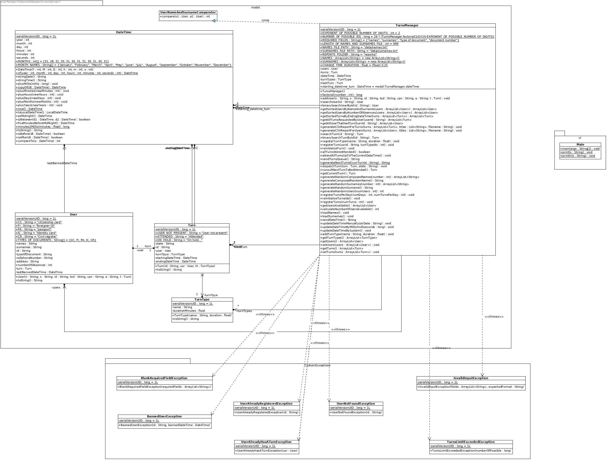

# TurnsApp 2.0 

 

## Context
A company has hired him to develop a program in his customer service department that solves the problem of control and attention of people who come to their service centers to be served.

The program will be used by an employee of the company who is at the entrance of the service center and with whom the person who enters to be attended will always communicate in the first instance.

The employee will look for you with your identity document number and then assign you a shift to be attended. The shift is made up of a letter and a number between 00 and 99. The first shift is A00, the next shift is A01 and so on. When the last number of a letter (99) is reached, it will change to the first number of the next letter and will continue. For example, the A99 is followed by the B00.

The program will also have the possibility of registering a new user in case they are not already registered in the system. The data of a user are type of identity document, document number, names, surnames, telephone and address. When adding a new user, it must be validated that at least the type of document, the document number, the names and surnames of the person are completed (that is, they are mandatory).

On the other hand, the program must allow progress to be made in the shift to the extent that another employee attends to each client according to the shift assigned to him. That person who is attending has the possibility to indicate to the program if they really attended the user with that shift or if they did not attend because they were no longer in the place when they were called to be attended.

The last explained functionality should be in a different program (or at least in a different profile) than the other functionalities since it is used by an employee with a different role than the first explained functionalities, however, since this is the first version of the program and for demonstration purposes, all the functionalities will be implemented in the same program. Each one in a different tab, as shown in the following mockups. The mockups were designed for a second version of the program, you must rely on them to be guided by the options that the program must have but you must develop your interface using a menu of options in a text console.

## Functional Requirements
+ The turns control system must be able to:
	
+ Add new users whose fields are: type of identity document, document number, names, surnames, telephone, and address. These last two fields are not mandatory, while the rest are. Duplicated users are not allowed. Two users are considered duplicated if their document number are equal.

+ Register new turns. These are unique and their nomenclature goes from A00 to Z99. To assign one, is needed to check if the user to whom the turn is going to be assigned exists and has no other turn assigned yet. Moreover, a turn has a type and duration (which depends on the type) that is specified by the user during its creation.

+ Eventually, a user that had a turn and was dispatched, can get another turn if and only if was present in the last two turns that requested; otherwise, will be suspended and will not be allowed to register a new turn for the next 2 days. 

+ Dispatch all pending turns automatically starting with the oldest one up to the turn that satisfies the condition that the summed datetime durations from the oldest to it, is before the current datetime. A turn is considered "dispatched" in two scenarios: the first, the user who owned that turn has already been attended; or second, the user who owned that turn wasn’t present. App must allows attend a turn assigned to some user regardless of whether there are more turns to be attended ahead of it. The scenario assigned to every turn must be randomly selected. 

+ Display on console the current system datetime composed by year, month, day, hour, minute and second.

+ Update the system datetime manually (typed by the user) or using the current datetime of computer.

+ Generate a report with all the turns that a person has ever requested, indicating the turn code, whether it was already attended or not and whether the person was present when they were called to be attended or not. 

+ Generate a report with all the people that ever owned a turn specified by user. E.g., user can search all the people that ever owned the turn C91.   

+ Randomly generate people registered in the system. The number of people to generate must be indicated by the user.

+ Randomly generate shifts associated with people previously registered in the system. The user must indicate how many shift days will be generated. And the generation always starts from the current day. The user must also indicate how many shifts will be generated for each day. 

## Non-functional requirements
This section describes the internal constraints of the proposed program. The number of every item correspond to the number of the functional requirement whose constraints are going to be defined; if the item has not a number as enumerator, then it is a global constraint.

* The model must define datetime class.

* The program must be persistent through the using of serializable interface.

* (8) The random generation of people should take the name values of several base text files (one for names, another for surnames) generated from a web tool.

* (6, 7) Reports must be presented either in console or exported in a text file according to the user selection.	 

* Every time that the user use a function of the system menu, it must be displayed on console how much time it took.

* It is needed least a sequential and a binary search.

* Throughout the development of the previous requirements, it is needed to have at least 5 orderings using the sort method of the Arrays class or the Collections class, using the Comparable interfaces on some class of the model, Comparator as an external class, Comparator as an anonymous class, a Comparator in reverse of the Collections method and a Comparator of a class already implemented from the Java API such as Integer or String (in the latter you should not implement the Comparator, just order an array or list of objects of a class Java that already comes with Comparator implemented).

## Credits

This program belongs to the second laboratory of AP2 (Algorithms and Programming II) of University ICESI

- Sebastián García Acosta
